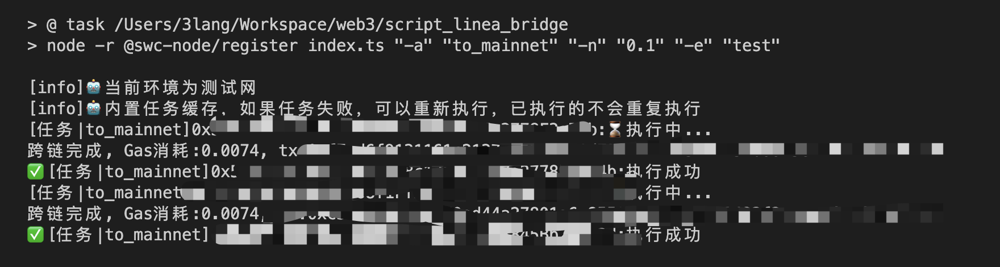

# Linea 官方桥脚本



## 功能

- 支持主网跨到linea
- 支持linea跨到主网

> 内置任务缓存，如果任务失败，可以重新执行，已执行的不会重复执行

## 环境

- Nodejs [lts](https://nodejs.org/en/download), 👉[教程戳这里](https://www.liaoxuefeng.com/wiki/1022910821149312/1023025597810528)

## 运行

- `pks.txt` 私钥列表，一行一个

```bash
npn i -g pnpm # 安装依赖管理工具
pnpm install # 安装依赖

# 主网跨0.1eth到linea
pnpm task -a to_linea -n 0.1

# linea跨0.1eth到主网
pnpm task -a to_mainet -n 0.1
pnpm task -a claim # 目前官方桥从linea跨到主网需要手动领取确认, 这一步需要在to_mainnet后，等待一定时间后再执行

# 清空任务缓存
pnpm task -a reset
```

> L2跨到L1的手动claim步骤，具体何时可以执行，可以去官方桥页面[查看](https://bridge.linea.build/)，如果有可领取的，会有claim按钮
